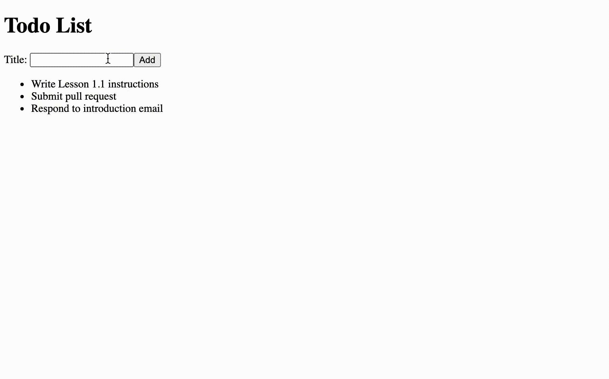

[< Back to Overview](../../README.md)

# Lesson 1.3: React Props and State

This assignment will teach you the following:

- React Props
- React State
- Handler Function
- Callback handlers

---

## Instructions

### Getting Started:

Merge your pull request from the previous lesson (if you haven't already):

[View tutorial](https://github.com/Code-the-Dream-School/common-instructions/blob/main/common/how-to-merge.md)

Checkout your main branch and pull changes:

    git checkout main
    git pull

Create a new local branch to work on separate from the `main` branch:

    git checkout -b lesson-1-3

Now, open the project directory in your code editor and continue to the next section.

### Task List:

#### Move List Item into New "Todo List Item" Component

- [x] Inside `/src` directory, create a new file called `TodoListItem.js`
- [x] Open `/src/TodoListItem.js`
- [x] Create a new functional React component (see below)
  - [x] Import `React` from "react" npm package
  - [x] Declare a function named `TodoListItem`
  - [x] Export `TodoListItem` function as default module
- [x] Add a multi-line return statement to your `TodoListItem` function (this is where we will insert JSX)
  - hint: use parenthesis for multi-line return
- [x] Move list item JSX from `TodoList.js` to `TodoListItem.js` (see below)
  - [x] Open `/src/TodoList.js`
  - [x] Cut (copy and remove) the list item element (`<li>`)
  - [x] Open `/src/TodoListItem.js`
  - [x] Inside the multi-line return, paste the list item element (`<li>`)
  - [x] Remove the `key` attribute
- [x] Refactor `TodoList.js` to use new `TodoListItem` component (see below)
  - [x] Open `/src/TodoList.js`
  - [x] Below `React`, import `TodoListItem`
  - [x] Inside the `map()` method, use the `TodoListItem` component
    - [x] Pass `key` as a prop equal to the `id` of the `todo` object
    - [x] Pass `todo` as a prop
- [x] Update `TodoListItem` component to use props (see below)
  - [x] Open `/src/TodoListItem.js`
  - [x] Add `props` as a parameter in the `TodoListItem` function
  - [x] Update the `todo` object reference to come from `props`
- [x] Run your application and view in browser
  - [x] Verify that your Todo List still appears correctly

#### Handle "Add Todo Form" Submit

- [x] Open `/src/AddTodoForm.js`
- [x] Add a `name` attribute to the text input with value `title`
- [x] Inside the `AddTodoForm` functional component, above the `return` statement, create a new function called `handleAddTodo` that takes `event` as a parameter
  - [x] First, inside this function, prevent the default behavior of the form submit
    - hint: `preventDefault` method
  - [x] Next, retrieve the value of the `title` element from the event target and store it in a variable named `todoTitle`
  - [x] Log the value of `todoTitle` in the console
  - [x] Finally, reset the form so the text input value is cleared
- [x] Add `onSubmit` prop to form element and pass the `handleAddTodo` function by reference
- [x] View your application in browser
- [x] Enter a value in the text input and submit the form
  - [x] Verify that the value you entered is visible in the console
  - [x] Verify that form is cleared properly

#### Store "New Todo" in React State

- [x] Open `/src/App.js`
- [x] Inside the `App` functional component, above the `return` statement, create a new state variable named `newTodo` with update function named `setNewTodo`
  - hint: `useState` hook
- [x] Below the `<AddTodoForm />` component, add a paragraph element that displays the value of `newTodo` variable
- [x] Pass `setNewTodo` as a callback handler prop named `onAddTodo` to the `AddTodoForm` component
- [x] Open `/src/AddTodoForm.js`
- [x] Add `props` as a parameter in the `AddTodoForm` function
- [x] Inside the `handleAddTodo` function, invoke the `onAddTodo` callback prop and pass `newTodo` as an argument
- [x] View your application in browser
- [x] Enter a value in the text input and submit the form
  - [x] Verify that the value you entered is visible beneath the form

#### Final Result

### Final Step:

Check the status of your local repository to double-check the changes you made:

    git status

Stage the file(s) that you edited:

    git add .

Check the status again and notice that the changes from before are now staged:

    git status

Create a commit for the changes you made and add a message describing the changes you made:

> Note: Replace `<message>` with your message

    git commit -m "<message>"

Push your commit to the remote repository (visible in GitHub):

    git push

Check the log to make sure your commit has been published:

    git log --oneline

Create a pull request and submit:

[View instructions](https://github.com/Code-the-Dream-School/common-instructions/blob/main/common/how-to-pull-request.md)

---

Created by [Code the Dream](https://www.codethedream.org)
