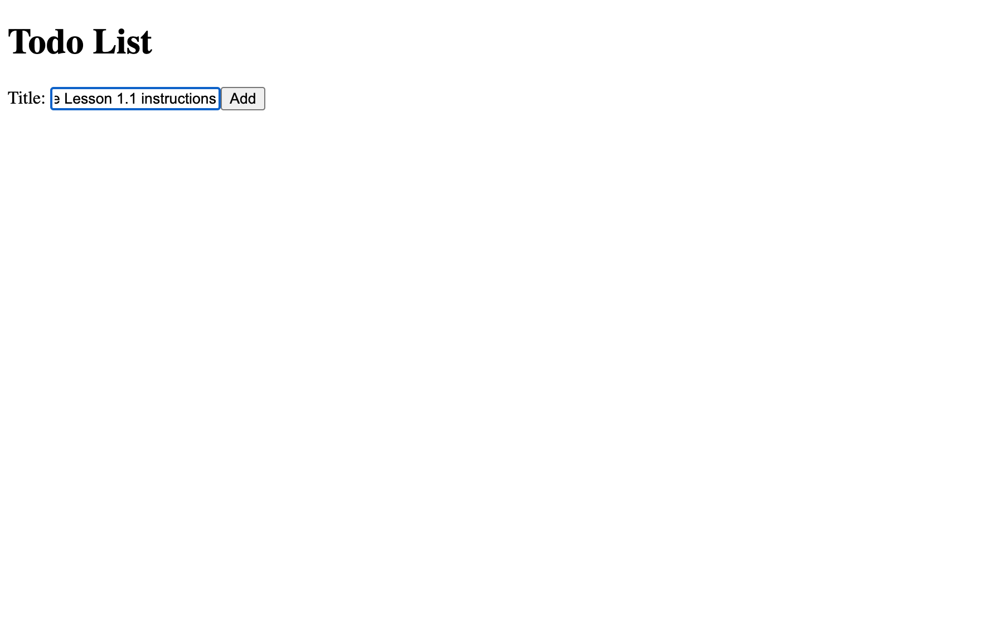
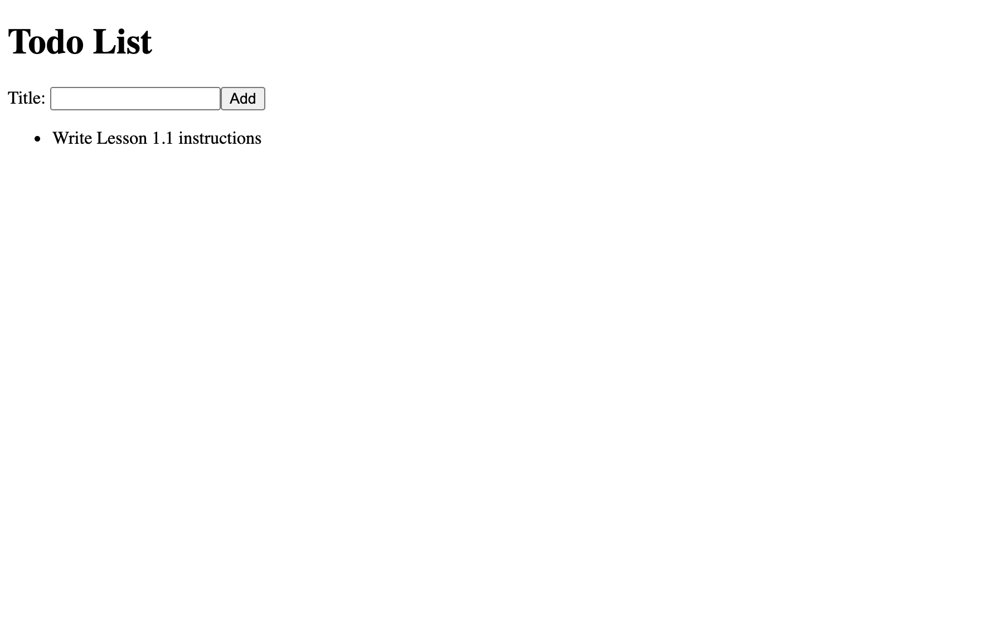
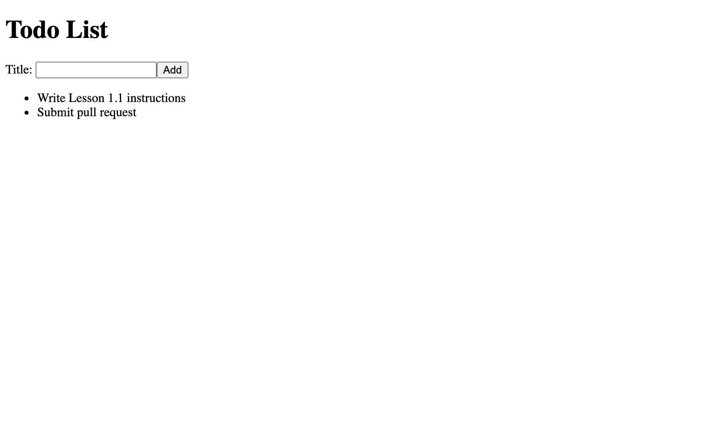

[< Back to Overview](../../README.md)

# Lesson 1.4: Advanced React Props and State

This assignment will teach you the following:

- Lifting State
- Controlled Components
- Props handling

---

## Instructions

### Getting Started:

Merge your pull request from the previous lesson (if you haven't already):

[View tutorial](https://github.com/Code-the-Dream-School/common-instructions/blob/main/common/how-to-merge.md)

Checkout your main branch and pull changes:

    git checkout main
    git pull

Create a new local branch to work on separate from the `main` branch:

    git checkout -b lesson-1-4

Now, open the project directory in your code editor and continue to the next section.

### Task List:

#### Move Todo List into State

- [x] Open `/src/App.js`
- [x] Create new state variable named `todoList` with setter `setTodoList` and default value of an empty Array
- [x] Pass `todoList` state as a prop named `todoList` to the `TodoList` component
- [x] Open `/src/TodoList.js`
- [x] Add `props` as a parameter to the `TodoList` functional component
- [x] Change `todoList` to reference props instead of the hard-coded variable
- [x] Delete the hard-coded `todoList` variable
- [x] Run your application and view in browser
  - [x] Verify that your Todo List is now empty (no list items)

#### Control "Add Todo" Input

- [x] Open `/src/AddTodoForm.js`
- [x] Create new state variable named `todoTitle` with setter `setTodoTitle`
- [x] Modify the `<input>` element to be a controlled input
  - [x] Add `value` prop equal to `todoTitle` from component state
  - [x] Add `onChange` prop equal to `handleTitleChange` function reference (we will declare this function in the next step)
- [x] Above the `handleAddTodo` function, declare a new function named `handleTitleChange` that takes `event` as a parameter
  - [x] First, retrieve the input value from the `event` object and store in variable named `newTodoTitle`
  - [x] Then, call the state setter `setTodoTitle` and pass `newTodoTitle`
- [x] In the `handleAddTodo` function, remove the `todoTitle` variable and update `onAddTodo` callback handler to pass our `todoTitle` state variable instead
- [x] Run your application and view in browser
  - [x] Enter a new todo in "Add Todo" form, submit, and verify that the title appears below

#### Add New Todo to List

- [x] Open `/src/App.js`
- [x] Remove the `newTodo` state variable and the corresponding JSX that displays it
- [x] Declare a new function named `addTodo` that takes `newTodo` as a parameter
  - [x] Call the `setTodoList` state setter and use the spread operator to pass the existing Objects in the `todoList` Array along with the `newTodo` Object
- [x] Change the value of the `onAddTodo` prop for `AddTodoForm` to `addTodo`
- [x] Open `/src/AddTodoForm.js`
  - [x] `title`: equal to `todoTitle`
  - [x] `id`: unique identifier (hint: use `Date.now()` to generate a unique number)
    - _Disclaimer: we are suggesting `Date.now()` for now as a placeholder for unique number generation, but in the future you should not use this_
- [x] Inside `handleAddTodo`, remove the `reset()` method and replace it with logic to reset the `todoTitle` state to an empty String
- [x] Run your application and view in browser
  - [x] Enter a todo in "Add Todo" form, submit, and verify item is visible in todo list
  - [x] Enter another todo, submit, and verify that two items are visible in todo list

#### Destructure Props

- [x] Open `/src/TodoList.js` and update `props` to use destructuring
- [x] Open `/src/TodoListItem.js` and update `props` to use destructuring
- [x] Open `/src/AddTodoForm.js` and update `props` to use destructuring

#### Final Result

Step 1: On page load, list is empty

Step 2: Entering a new todo

Step 3: After submitting new todo

Step 4: After submitting another new todo

### Final Step:

Check the status of your local repository to double-check the changes you made:

    git status

Stage the file(s) that you edited:

    git add .

Check the status again and notice that the changes from before are now staged:

    git status

Create a commit for the changes you made and add a message describing the changes you made:

> Note: Replace `<message>` with your message

    git commit -m "<message>"

Push your commit to the remote repository (visible in GitHub):

    git push

Check the log to make sure your commit has been published:

    git log --oneline

Create a pull request and submit:

[View instructions](https://github.com/Code-the-Dream-School/common-instructions/blob/main/common/how-to-pull-request.md)

---

Created by [Code the Dream](https://www.codethedream.org)
