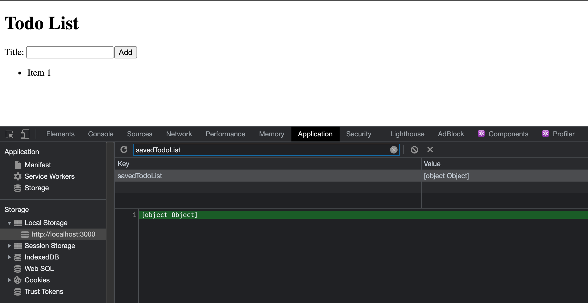
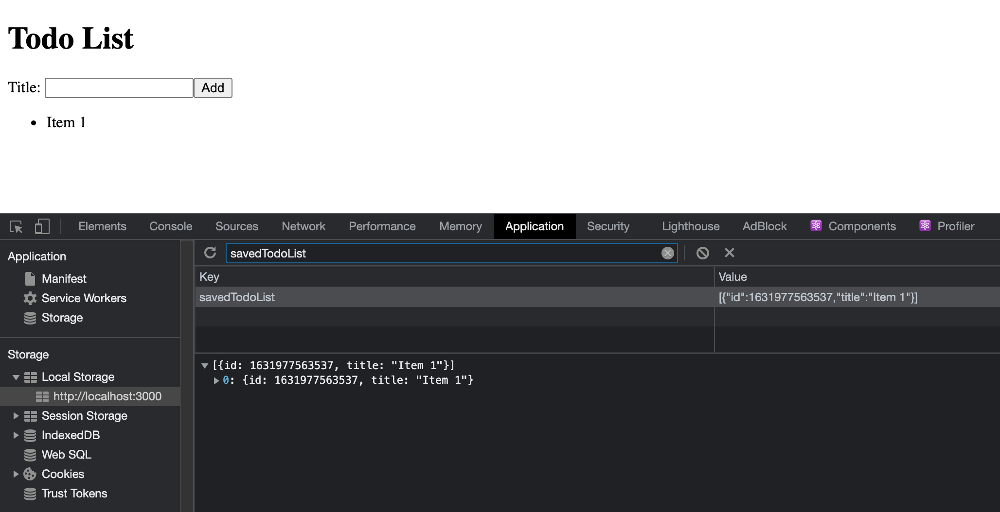
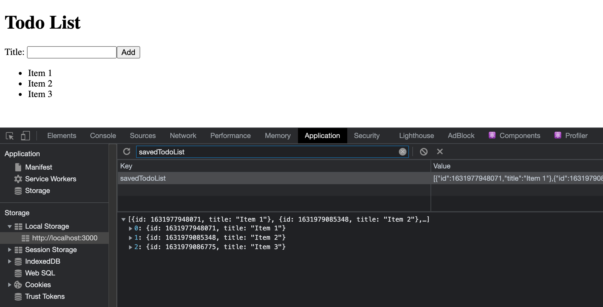

[< Back to Overview](../../README.md)

# Lesson 1.5: React Hooks

This assignment will teach you the following:

- Side-effects
- Custom Hooks
- Fragments

---

## Instructions

### Getting Started:

Merge your pull request from the previous lesson (if you haven't already):

[View tutorial](https://github.com/Code-the-Dream-School/common-instructions/blob/main/common/how-to-merge.md)

Checkout your main branch and pull changes:

    git checkout main
    git pull

Create a new local branch to work on separate from the `main` branch:

    git checkout -b lesson-1-5

Now, open the project directory in your code editor and continue to the next section.

### Task List:

#### Save Todo List in Storage

So far you've built a todo list that allows you to add as many new items as you want, but what happens when you refresh the page? The list disappears!

In this lesson, you will learn how to save your list in local browser storage so it persists between page loads.

- [x] Open `/src/App.js`
- [x] Define a `useEffect` React hook with `todoList` as a dependency
- [ ] Inside the side-effect handler function, save the `todoList` inside `localStorage` with the key `"savedTodoList"`
  - Hint: `localStorage.setItem` method
- [x] Run your application and view in browser
  - [x] Enter a new todo in "Add Todo" form and submit
  - [x] Open your Local Storage panel in the DevTools
    - In Chrome: DevTools > Application > Local Storage > localhost
  - [x] Verify that your `"savedTodoList"` item exists
  - [x] Notice that the value, however, is not readable (see below)

- [x] Open `/src/App.js`
- [x] Update your side-effect function to convert `todoList` to a string before saving in `localStorage`
  - Hint: `JSON.stringify` method
- [x] View your application in browser
  - [x] Clear your Local Storage
    - In Chrome: DevTools > Application > Storage > Click "Clear site data"
  - [x] Repeat the same steps from above
  - [x] Notice that the value is completely readable as a string (see below)

Now your list is saved in Local Storage, but when you refresh the page? It still disappears!

This is because we wrote the list data to Local Storage but we aren't reading it when the application is rendered. Let's fix that:

- [x] Open `/src/App.js`
- [x] Update the default state for `todoList` to read your `"savedTodoList"` item from `localStorage`
  - Hint: `localStorage.getItem` method
- [x] View your application in browser
  - [x] Notice that there is an error, `todoList` is not an Array

How could our list not be an Array? Right! We turned it into a string before saving in Local Storage. So now that we're ready to use the value, we need to turn it back into an Array.

- [x] Open `/src/App.js`
- [x] Update your default state to parse the value of the `"savedTodoList"` item
  - Hint: `JSON.parse` method
- [x] View your application in browser
  - [x] Notice that your previous todo item(s) are still visible after refreshing the page

#### Create Custom Hook

- [x] Open `/src/App.js`
- [x] Above the `App` functional component, create a new function named `useSemiPersistentState` which will be a custom hook
- [x] Cut (copy/remove) the `useState` and `useEffect` hooks from `App` into `useSemiPersistentState`
- [x] Add a `return` statement in `useSemiPersistentState` that returns the `todoList` state variable and setter in an Array (just like how it's returned from the `useState` hook)
- [x] Update `App` to use the new custom hook
  - Hint: Copy the `useState` hook from before, but change `useState` to the custom hook `useSemiPersistentState` (no arguments)
- [x] View your application in browser
  - [x] Verify that your Todo List still appears correctly

#### Fragments

- [x] Open `/src/App.js` and update the JSX to use a Fragment

#### Final Result

### Final Step:

Check the status of your local repository to double-check the changes you made:

    git status

Stage the file(s) that you edited:

    git add .

Check the status again and notice that the changes from before are now staged:

    git status

Create a commit for the changes you made and add a message describing the changes you made:

> Note: Replace `<message>` with your message

    git commit -m "<message>"

Push your commit to the remote repository (visible in GitHub):

    git push

Check the log to make sure your commit has been published:

    git log --oneline

Create a pull request and submit:

[View instructions](https://github.com/Code-the-Dream-School/common-instructions/blob/main/common/how-to-pull-request.md)

---

Created by [Code the Dream](https://www.codethedream.org)
